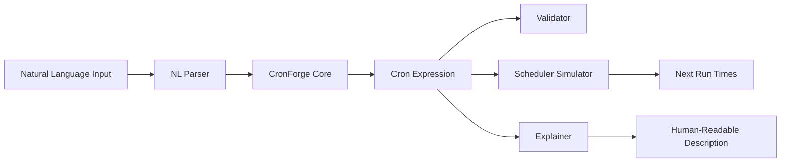

# CronForge

[](https://github.com/officethree/CronForge/actions/workflows/ci.yml)
[](https://www.python.org/downloads/)
[](LICENSE)
[](https://github.com/psf/black)

**Smart cron job generator** — a Python library that generates and validates cron expressions from natural language descriptions, with scheduling simulation.

---

## Architecture



## Quickstart

### Installation

```bash
pip install cronforge
```

Or install from source:

```bash
git clone https://github.com/officethree/CronForge.git
cd CronForge
pip install -e .
```

### Usage

```python
from cronforge import CronForge

cf = CronForge()

# Generate cron from natural language
expr = cf.from_natural("every 5 minutes")
print(expr)  # */5 * * * *

expr = cf.from_natural("daily at 3pm")
print(expr)  # 0 15 * * *

expr = cf.from_natural("every Monday at 9am")
print(expr)  # 0 9 * * 1

# Validate a cron expression
print(cf.validate("*/5 * * * *"))  # True
print(cf.validate("99 * * * *"))   # False

# Explain a cron expression in plain English
print(cf.explain("0 9 * * 1-5"))
# "At 09:00, Monday through Friday"

# Get next run times
from datetime import datetime
runs = cf.next_runs("0 9 * * 1", count=3, start=datetime(2026, 3, 25))
for run in runs:
    print(run)

# Simulate runs in a date range
from datetime import datetime
runs = cf.simulate("0 */2 * * *", start=datetime(2026, 3, 25), end=datetime(2026, 3, 26))
print(f"Total runs in 24h: {len(runs)}")

# Convert cron back to natural language
print(cf.to_natural("*/15 * * * *"))
# "Every 15 minutes"

# Common presets
presets = cf.common_presets()
for name, expr in presets.items():
    print(f"{name}: {expr}")
```

### Parse a Cron Expression

```python
parsed = cf.parse("30 2 * * 0")
print(parsed)
# CronExpression(minute='30', hour='2', day='*', month='*', weekday='0')
```

## Supported Natural Language Phrases

| Phrase                        | Cron Expression   |
|-------------------------------|-------------------|
| every minute                  | * * * * *         |
| every 5 minutes               | */5 * * * *       |
| every hour                    | 0 * * * *         |
| every 2 hours                 | 0 */2 * * *       |
| daily at 3pm                  | 0 15 * * *        |
| daily at midnight             | 0 0 * * *         |
| every Monday at 9am           | 0 9 * * 1         |
| weekdays at 8:30am            | 30 8 * * 1-5      |
| first of every month          | 0 0 1 * *         |
| every Sunday at noon          | 0 12 * * 0        |
| hourly at :30                 | 30 * * * *        |

## Development

```bash
make install    # Install dependencies
make test       # Run tests
make lint       # Run linter
make format     # Format code
```

## Inspired by

DevOps automation and scheduling trends. CronForge aims to make cron expression management accessible to everyone, from seasoned sysadmins to developers just getting started with job scheduling.

## License

[MIT](LICENSE) &copy; 2026 Officethree Technologies

---

Built by **Officethree Technologies** | Made with love and AI
